# dice-step-game

Dice Step game is a website that allows users to play game by rolling and dice and the number will that appears is the number to choose from paly the area. The game contains three type of buttons inorder for the user to start the game, roll dice and end the game, and once the user clicked a start button he will  be prompted to the game to play. The game records the number of steps and score results of the user obtained during the game play. The game can help the user to improve their problem solving skills and level. View the live site [here](https://bky201.github.io/step-game/index.html).

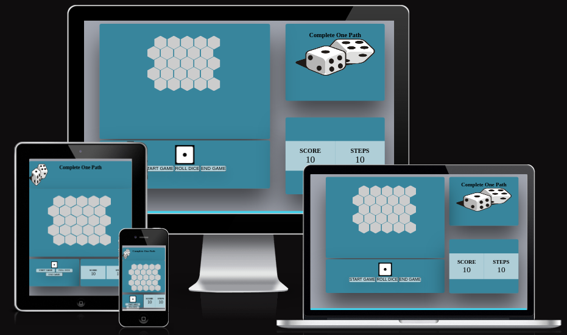

### Existing Features

### Main Page
* Favicon 
  * A favicon brand is a dice with all the faces from 1 to 6.

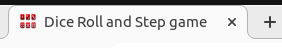

* The Dice-Step-Game Logo and Heading
  * The logo and heading of the Dice-Step-Game are prominently displayed at the top of the page, ensuring easy visibility and clear meaning for the user wht the game is about. When the user visits the page, they will immediately notice the game's name.

  

### Home Page
* Web page 
  * This will include two button and an instruction on how to play the game. 
  * These buttons are to give the user a first access about the website and  how to navigate.

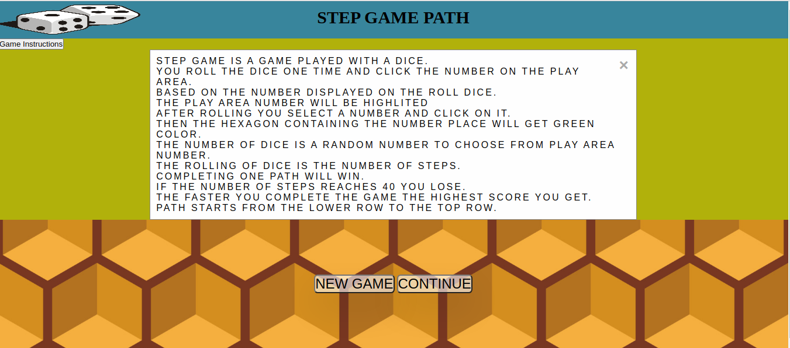

  * The Game Area
  * In this section, the user will have the opportunity to engage in a game. They will have a clear view of the buttons, making it easy for them to choose their numbers.
  

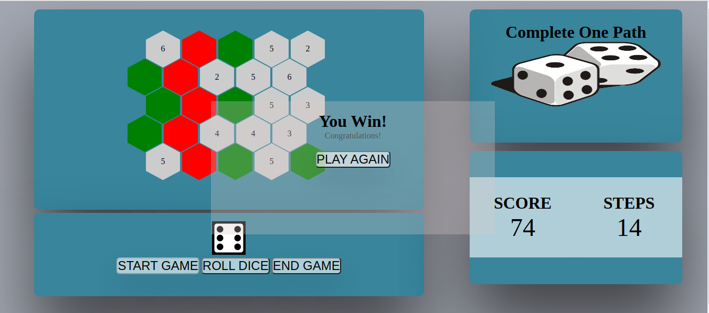

* Home Page Button
  * NEW GAME button gives the user a choice to start a new game by clear the previous generated game.
  * CONTINUE GAME button gives the user the choice to continue playing playing a game that was already closed.

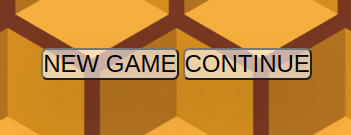

  

* Footer
  * This will feature a number of social network icons that will open in new tabs. 
  * These social media links make it convenient for visitors to connect with our club on various social platforms. This will allow users to engage with our social media accounts, follow our updates, and potentially share our content with their own network, thereby increasing brand exposure.
 
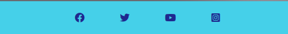

* 404 Page
  * A 404-page not found is a user-friendly experience on websites, helping visitors understand that the requested content is unavailable or has been moved. 
  * If a user attempts to access an unavailable link, a 404 page will be put in place to be displayed.

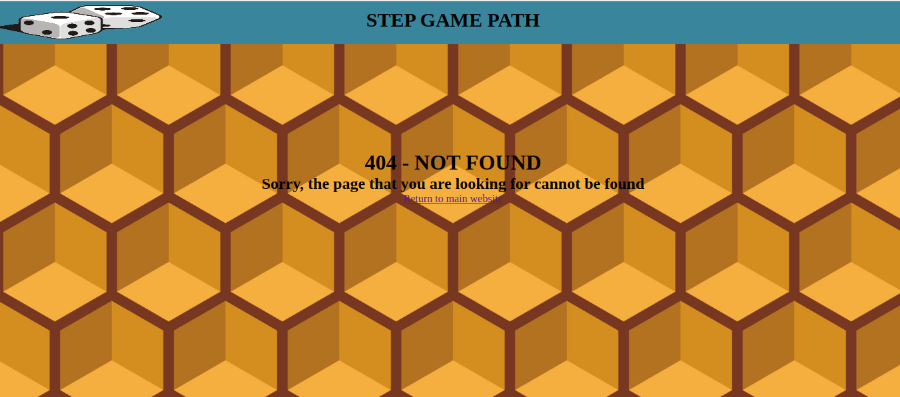

* Game Button
  * START GAME button the game with random number being generated.
  * ROLL DICE button for user to attempt rolling pick a number to mark the play area.
  * END GAME button to allow user quit and stop play.

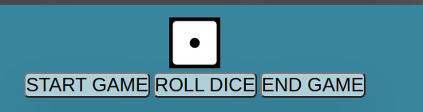

* Yellow highlight

  * After starting the game every time the user rolls a dice the game area will automatically genate yellow highlighted options for the user to select.
  * This will make it fast and easy for the user to choose a number.
  

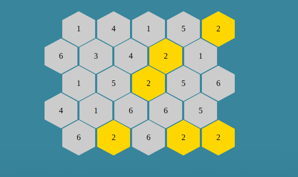

* Green highlight

  * After starting the game every time the user selects a step the game area will automatically genate green highlighted options for the user.
  * This will make it disabled and and it will make it easy for the user to complete a path by following the this green path.

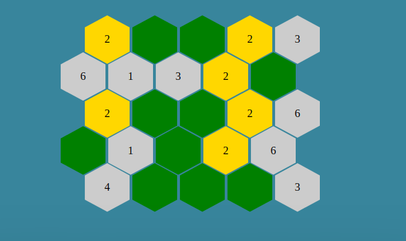

* Initial Score

  * After starting the game it will the user will get automatically assigned a score of 100 and the steps count will get 0 value.

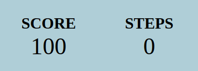

* Final Score

  * After completing the game the score is calculate by deducting the number of steps multiplied by 2.

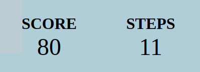

* Game Winner

  * The winner will get a pop up screen by showing a red path
  * This indicates the user has completed the game successfuly and and he get prompted to start again. 

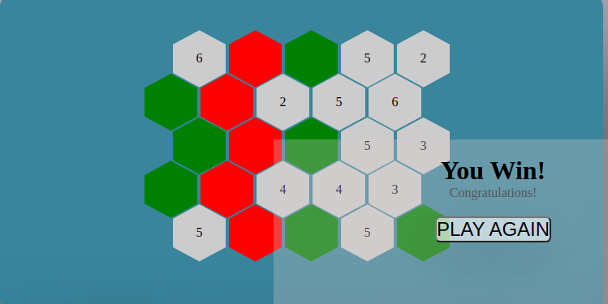
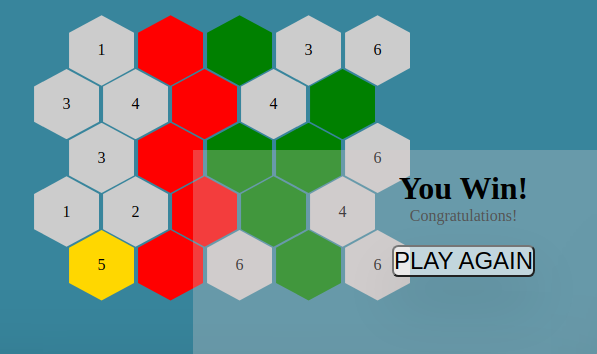

* Game Over

  * The game is limited to 40 steps and if this limit has reached the user will get a game over pop up screen.

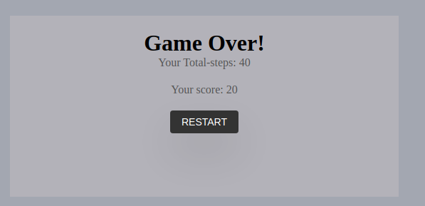

### Remaining functionalities to be integrated
* Adding game Sound Button using HTMl Audio element to play sounds. HTML5 Audio provides a simple way to embed audio files in our game. We can create an Audio object in JavaScript and play, pause, or manipulate the audio playback using its methods and properties.

* Game Highest Score storage. To store the highest score in a game, we can use different storage options depending on the platform and requirements of our game. Local Storage allows to store key-value pairs in the user's web browser. We can store the highest score as a value and retrieve it when needed.

### Design Section Rough Sketches

#### Start Pop-up Page Rough sketches

* Start Pop-up Page

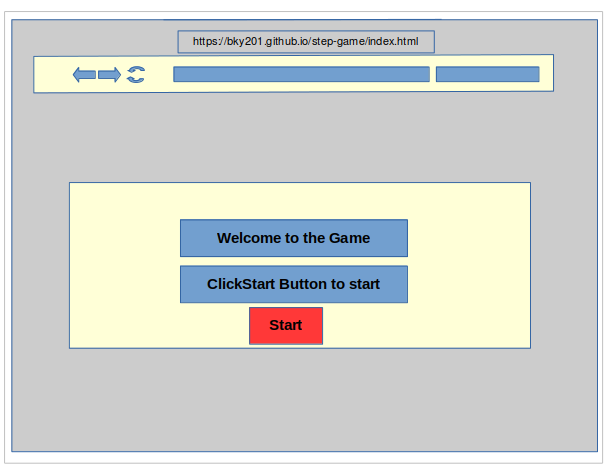

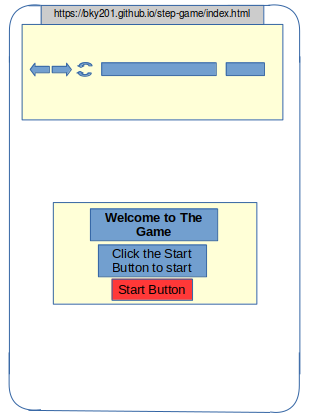

#### Home Page Rough sketches

* Home Page

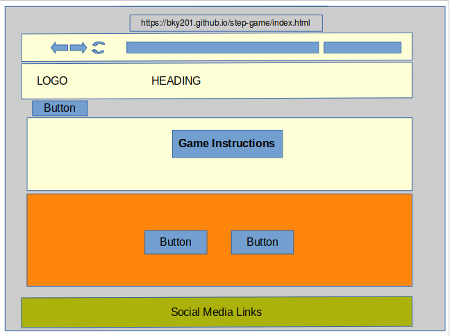
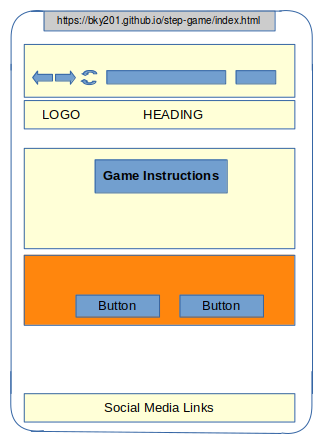

#### Game Page Rough sketches

* Game Page

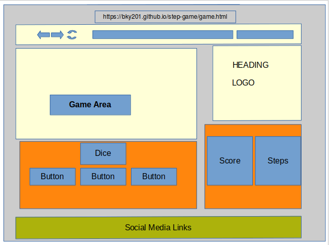
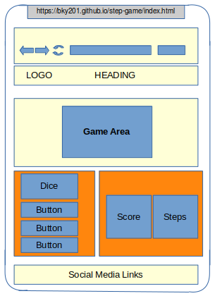

#### 404 Page Rough sketches

* 404 Page

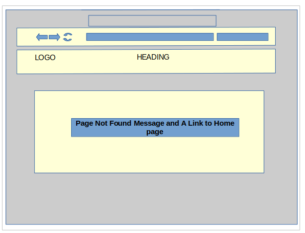
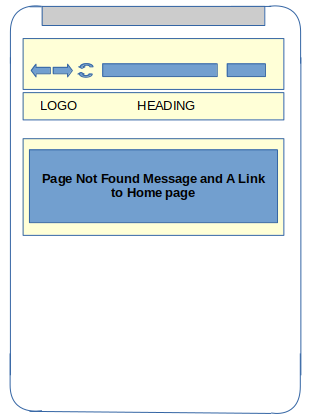

### Tecgnologies

* Visual Studio Code
  * Visual Studio Code IDE tool was utilized in building the website. 
* HTML
  * The primary language utilized in constructing the Website's structure was HTML.
* CSS
  * The styling of the Website was designed by utilizing an separate CSS file.
* Git
  * The source code of the Website was regularly committed and pushed during its development using Git.  
* GitHub
  * The source code of the website is accessible on GitHub, and it has been uploaded using Git Pages.  
* Favicon.io
  * The favicon files were generated using https://favicon.io/favicon-converter/.  
* Font Awesome
  * The social media links in the footer section were adorned with icons obtained from https://fontawesome.com/.  
* Tinyjpg
  * To reduce the size of the images used throughout the website, https://tinyjpg.com/ was employed as main tool.  

## Testing

### Web Page Responsiveness

To guarantee responsiveness, all pages were test through [ WCAG 2.1 Reflow criteria for responsive design](https://www.w3.org/WAI/WCAG21/Understanding/reflow.html) on screen sizes starting from 320px and above, following the criteria for responsive design. This testing was conducted on Chrome, Edge, and Firefox.
The foloowing testing method was implemented.
1. Launch a web browser and visit Dice Step Game Web site.
2. Access the developer tools by right-clicking and selecting "Inspect."
3. Switch to the responsive mode and reduce the width to smaller size.
4. Adjust the zoom level.
5. Click and drag the responsive window to its maximum width.

The Expected Output:

The website exhibits responsiveness across all screen sizes, ensuring that no images appear stretched. There is no horizontal scroll present, and all elements are properly arranged without any overlapping.

The Actual Output:

The website generally performed as anticipated, although there were some issues specifically observed when switching to smaller screen views. 

### Accessibility

Throughout the development process and during the final testing of the deployed website, the [ Wave Accessibility tool ](https://wave.webaim.org/) was employed to conduct accessibility testing. The testing procedure focused on verifying that the website adhered to the following criteria:

1. Proper labeling and alternative text: All elements, such as form controls and images, were appropriately labeled and included descriptive alternative text.

2. Color contrast: Sufficient color contrast was ensured between text and background colors to enhance readability for individuals with visual impairments.

3. Heading structure: The headings were organized in a logical hierarchy, aiding in content navigation and comprehension.

4. Link accessibility: Links were clearly identified and provided meaningful text to indicate their purpose or destination.

5. Form validation and error handling: Form inputs were validated and clear error messages were provided to assist users in correcting any input errors.

By employing the Wave Accessibility tool and adhering to these criteria, the website aimed to enhance its accessibility and ensure a user-friendly experience for individuals with disabilities.

### Footer Link

To verify that the Social Media icon in the footer opens in a new tab, a test was conducted by clicking on the Social Media icon.

All the Social Media links opened in a new tab.

## Game Play

### Winning Route

To ensure that all routes were correctly recorded as the 'winning route' with the accurate indices, testing was conducted using the following arrays:

    const targetElements = [

    elements[0][0],
    elements[1][0],
    elements[2][0],
    elements[3][0],
    elements[4][0]
      ];
  
    const targetElements = [

    elements[0][0],
    elements[1][1],
    elements[2][0],
    elements[3][1],
    elements[4][0]
      ];
  
      const targetElements = [

    elements[0][1],
    elements[1][1],
    elements[2][1],
    elements[3][1],
    elements[4][1]
      ];
  
      const targetElements = [

    elements[0][1],
    elements[1][2],
    elements[2][1],
    elements[3][2],
    elements[4][1]
      ];
  
      const targetElements = [

    elements[0][2],
    elements[1][2],
    elements[2][2],
    elements[3][2],
    elements[4][2]
      ];
  
      const targetElements = [

    elements[0][2],
    elements[1][3],
    elements[2][2],
    elements[3][3],
    elements[4][2]
      ];
  
      const targetElements = [

    elements[0][3],
    elements[1][3],
    elements[2][3],
    elements[3][3],
    elements[4][3]
      ];
  
     const targetElements = [

    elements[0][3],
    elements[1][4],
    elements[2][3],
    elements[3][4],
    elements[4][3]
     ];
  
      const targetElements = [
    
    elements[0][4],
    elements[1][4],
    elements[2][4],
    elements[3][4],
    elements[4][4]
     ];

### Website Validation Test 

#### HTML Validator
* HTML
  * No errors were returned when passing through the [W3C validator](https://validator.w3.org/#validate_by_input).

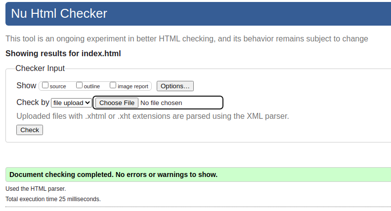

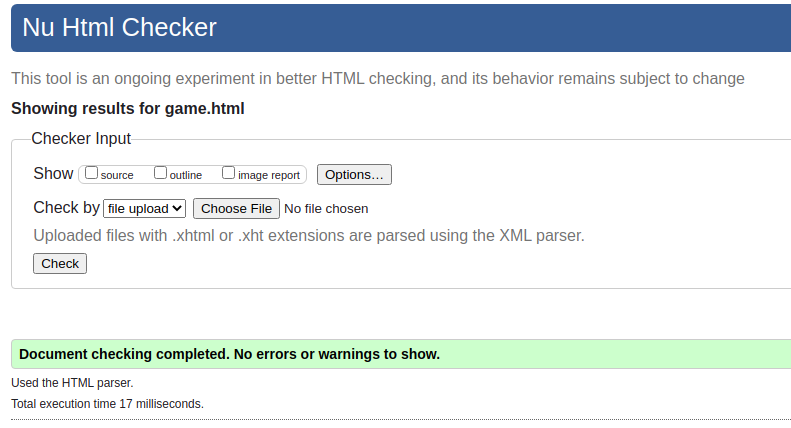

#### CSS Validator
* CSS
  * No errors were found when passing through the official [(Jigsaw) validator](https://jigsaw.w3.org/css-validator/).

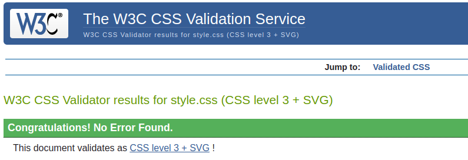

#### JS Validator
* Javascript
  * No errors were found when passing through the official [Jshint validator](https://jshint.com/).

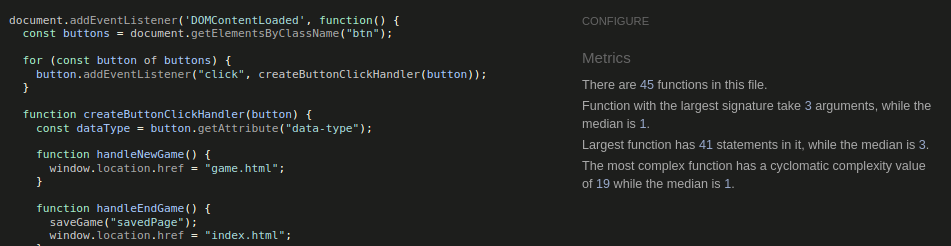

## Unfixed Bugs

* Saving data on local storage and retrieving it back can be a useful feature, but it may come with unsolved issues related to bugs or errors that need to be addressed. The game is working fine but was not able to continue play the game that was saved previously.

### Lighthouse  Result

After generating a Lighthouse report, it was observed that the SEO rating was 91, primarily because meta descriptions were missing. To address this, meta descriptions were subsequently added to the page to improve the SEO rating. The lowest score obtained in any section of the report was 95, which pertained to the performance aspect.

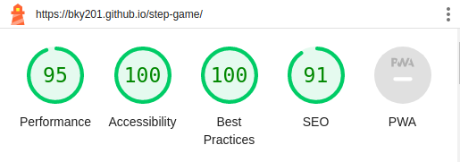

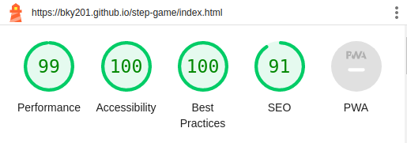

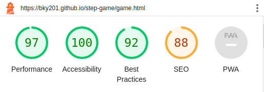

## Deployment

### Repository

The website was developed using the Visual Studio code editor and uploaded to the remote repository named 'step-game' on GitHub.

During the development process, the following Git commands were utilized to push the code to the remote repository:

1. `git add [file]` command was utilized to include the file(s) in the staging area prior to committing them.
2. `git commit -m [commit message]` command was employed to record and save the changes made to the local repository, preparing them for the final step.
3. `git push` command was utilized to upload all committed code to the remote repository on GitHub.

### Hosting on Github Pages

* The website was successfully published on GitHub Pages. The deployment process involved the following steps:
  * Navigate to the "Settings" tab within the GitHub repository.
  * Navigate to pages on the left menu
  * Navigate to source section and select brach "main" and click "save"
  * Once published successfully, after waiting for some time a live link will be generated as follow:
  
  Your site is live at https://bky201.github.io/step-game/index.html

### Clone the repository code locally

To create a local copy of the repository code by cloning it just do the following steos:

  * Navigate to the GitHub Repository that you want to clone locally, and then click on the dropdown button labeled "Code".
  * Click on "HTTPS" and copy the link
  * Open your IDE and install git
  * On your cmd line write git clone "your https link"

## Credits

* The images on the homepage were sourced from a specific website called [shutterstock](https://www.vecteezy.com/vector-art/6050394-abstract-geometric-shape-hexagon-background).

* The dice image and Logo on the game page were sourced from [Clipart Library](https://clipart-library.com/dice-faces.html).

* The ReadMe page were sourced from a Code Institute Mentor [Gareth McGirr's Repo](https://github.com/Gareth-McGirr/tacos-travels/blob/main/README.md).

* Code institute Mentor [Gareth McGirr](https://www.linkedin.com/in/gareth-mcgirr/), who has shown exceptional generosity and went above and beyond the expected level of assistance, has graciously supported me by providing valuable tips and guidance throughout the completion of this project.