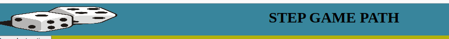

# dice-step-game

Dice Step game is a website that allows users to play game by rolling and dice and the number will that appears is the number to choose from paly the area. The game contains three type of buttons inorder for the user to start the game, roll dice and end the game, and once the user clicked a start button he will  be prompted to the game to play. The game records the number of steps and score results of the user obtained during the game play. The game can help the user to improve their problem solving skills and level. View the live site [here](https://bky201.github.io/step-game/index.html).

### Existing Features

### Main Page
* Favicon 
  * A favicon brand is a dice with all the faces from 1 to 6.

* The Dice-Step-Game Logo and Heading
  * The logo and heading of the Dice-Step-Game are prominently displayed at the top of the page, ensuring easy visibility and clear meaning for the user wht the game is about. When the user visits the page, they will immediately notice the game's name.

  

  * The Game Area
  * In this section, the user will have the opportunity to engage in a game. They will have a clear view of the buttons, making it easy for them to choose their numbers.
  

  

* Footer
  * This will feature a number of social network icons that will open in new tabs. 
  * These social media links make it convenient for visitors to connect with our club on various social platforms. This will allow users to engage with our social media accounts, follow our updates, and potentially share our content with their own network, thereby increasing brand exposure.
 

### Home Page
* Web page 
  * This will include two button and an instruction on how to play the game. 
  * These buttons are to give the user a first access about the website and  how to navigate.

* 404 Page
  * A 404-page not found is a user-friendly experience on websites, helping visitors understand that the requested content is unavailable or has been moved. 
  * If a user attempts to access an unavailable link, a 404 page will be put in place to be displayed.

